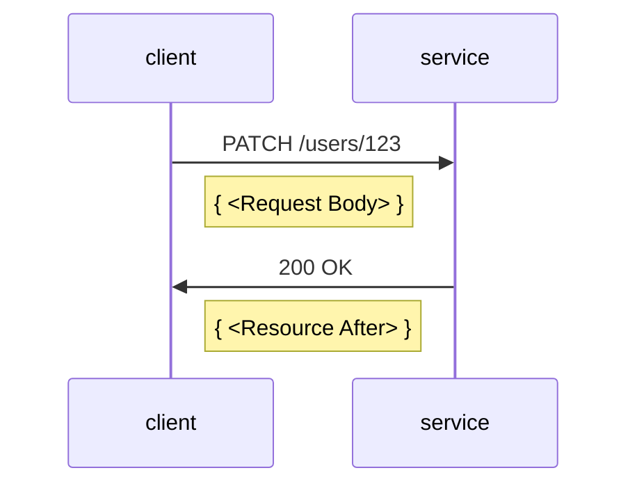

# Example cases for JSON Merge Patch Proposal

The following illustrates how our implementation of .NET Patch models for JSON Merge Patch would affect resources on the service side.
It shows the before/after of the resource representation on the service, alongside the HTTP request message sent to the service that caused the change.
It also shows the C# code you would write to achieve the change.

## Samples

- [Create a new resource]()
- [Update a top-level property]()
- [Update a property on a nested model]()
- [Replace a nested model]()
- [Update a dictionary value]()
- [Clear a dictionary]()
- [Update an array value - primitives]()
- [Update an array value - objects]()
- [Update an array using ETags]()

## Create a new resource

### Resource state

<table>
  <tr>
    <td><b>Resource Before</b></td>
    <td><b>Request Body: Merge Patch JSON</b></td>
    <td><b>Resource After</b></td>
  </tr>
  <tr>
<td valign="top">

```json
{
}
```

</td>
<td valign="top">

```json
{
  "firstName": "Alice", 
  "lastName": "Smith"
}
```

</td>
<td valign="top">

```diff
{
+  "id": "123",
+  "firstName": "Alice", 
+  "lastName": "Smith"
 } 
```

</td>
  </tr>
</table>

### C# code

```csharp
public class User
{
    public User(string id) { /****/ }
    internal User(string id, string first, string last) { /****/ }

    public string Id { get; }
    public string FirstName { get; set; }
    public string LastName { get; set; }
}

User user = new User("123");
user.FirstName = "Alice";
user.LastName = "Smith";
client.UpdateUser(user);
```

### HTTP traffic



## Update a top-level property

## Update a property on a nested model

## Replace a nested model

## Update a dictionary value

## Clear a dictionary

## Update an array value - primitives

## Update an array value - objects

## Update an array using ETags

## Related work

- [.NET Patch Models Design Principles](https://gist.github.com/annelo-msft/ae16eda80b382cc3ae9428954c08e069)
- [JSON Merge Patch Arch Board Issue](https://github.com/Azure/azure-sdk/issues/5966)
