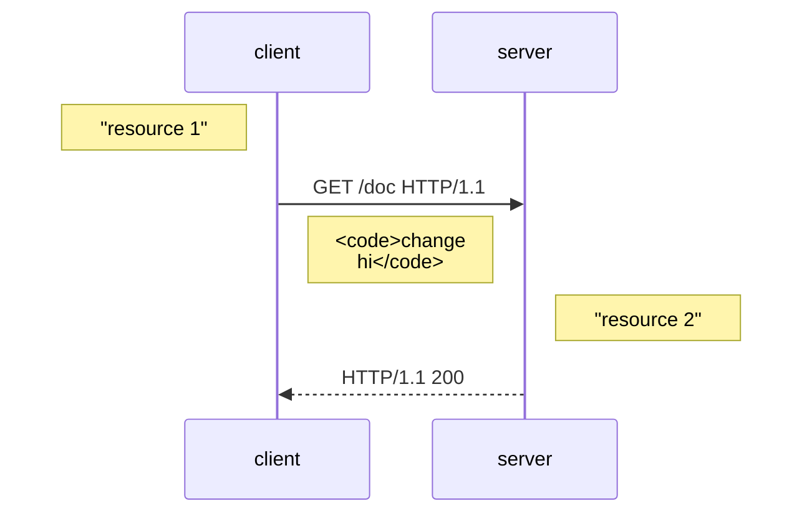

## Code samples for JSON Merge Patch Proposal

The following illustrates how our implementation of .NET Patch models for JSON Merge Patch would affect resources on the service side.
It shows the before/after of the resource representation on the service, alongside the HTTP request message sent to the service that caused the change.
It also shows the C# code you would write to achieve the change.

### Samples

	
Create a new resource

	
Update a top-level value

