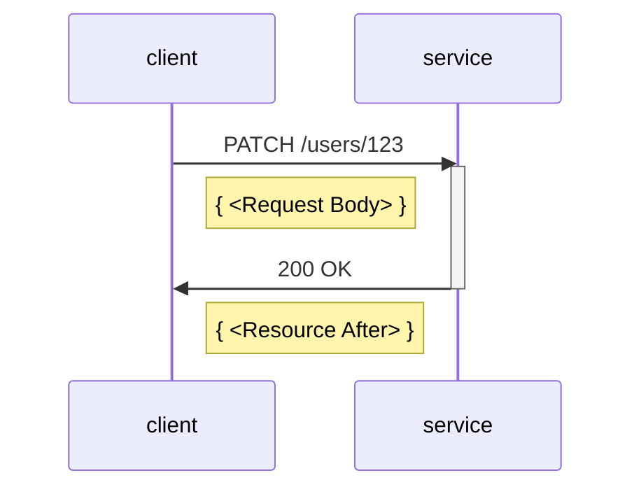
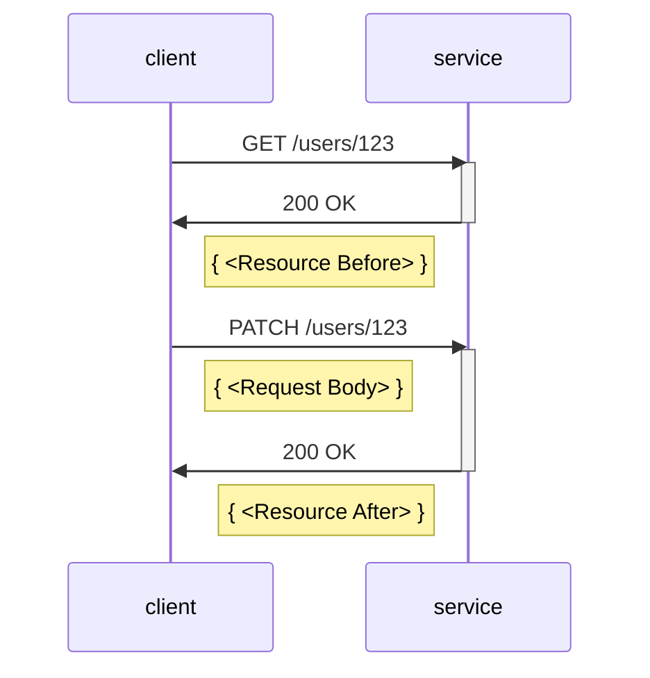
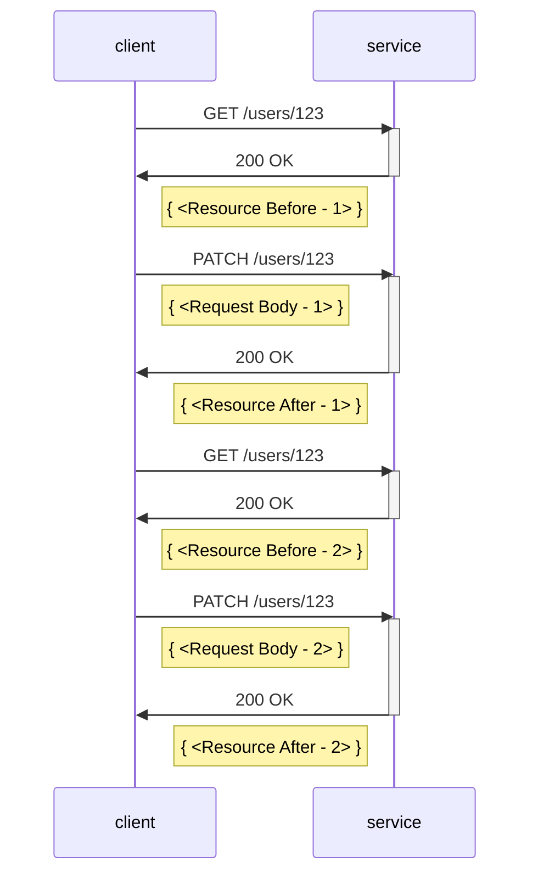

# Example cases for JSON Merge Patch Proposal

The following illustrates how our implementation of .NET Patch models for JSON Merge Patch would affect resources on the service side.
It shows the before/after of the resource representation on the service, alongside the HTTP request payload sent to the service that would cause the change.
It also shows the C# code you would write to achieve the change.

## Samples

- [Create a new resource](#create-a-new-resource)
- [Update a top-level property](#update-a-top-level-property)
- [Update a property on a nested model](#update-a-property-on-a-nested-model)
- [Replace a nested model - "Torn Write" scenario](#replace-a-nested-model---torn-write-scenario)
- [Update a dictionary value](#update-a-dictionary-value)
- [Clear a dictionary](#clear-a-dictionary)
- [Update an array value - primitives](#update-an-array-value---primitives)
- [Update an array value - objects](#update-an-array-value---objects)
- [Update an array using ETags](#update-an-array-using-etags)

## Create a new resource

### Resource state

<table>
  <tr>
    <td><b>Resource Before</b></td>
    <td><b>Request Body: Merge Patch JSON</b></td>
    <td><b>Resource After</b></td>
  </tr>
  <tr>
<td valign="top">

```json
{
}
```

</td>
<td valign="top">

```json
{
  "firstName": "Alice", 
  "lastName": "Smith"
}
```

</td>
<td valign="top">

```diff
{
+  "id": "123",
+  "firstName": "Alice", 
+  "lastName": "Smith"
 } 
```

</td>
  </tr>
</table>

### C# code

```csharp
public class User
{
    public User(string id) { /****/ }
    internal User(string id, string first, string last) { /****/ }

    public string Id { get; }
    public string FirstName { get; set; }
    public string LastName { get; set; }
}

User user = new User("123");
user.FirstName = "Alice";
user.LastName = "Smith";
client.UpdateUser(user);
```

### HTTP traffic



## Update a top-level property

### Resource state

<table>
  <tr>
    <td><b>Resource Before</b></td>
    <td><b>Request Body: Merge Patch JSON</b></td>
    <td><b>Resource After</b></td>
  </tr>
  <tr>
<td valign="top">

```json
{
  "id": "123",
  "firstName": "Alice",
  "lastName": "Smith"
}
```

</td>
<td valign="top">

```json
{
  "lastName": "Jones"
}
```

</td>
<td valign="top">

```diff
{
  "id": "123",
  "firstName": "Alice", 
-  "lastName": "Smith"
+  "lastName": "Jones"
 } 
```

</td>
  </tr>
</table>

### C# code

```csharp
public class User
{
    public User(string id) { /****/ }
    internal User(string id, string first, string last) { /****/ }

    public string Id { get; }
    public string FirstName { get; set; }
    public string LastName { get; set; }
}

User user = client.GetUser("123");
user.LastName = "Jones";
client.UpdateUser(user);
```

### HTTP traffic



## Update a property on a nested model

### Resource state

<table>
  <tr>
    <td><b>Resource Before</b></td>
    <td><b>Request Body: Merge Patch JSON</b></td>
    <td><b>Resource After</b></td>
  </tr>
  <tr>
<td valign="top">

```json
{
  "id": "123",
  "firstName": "Alice",
  "lastName": "Smith",
  "address" : {
    "street": "One Microsoft Way",
    "city": "Redmond",
    "state": "WA",
    "zipCode": "98052"
  }
}
```

</td>
<td valign="top">

```json
{
  "address": {
    "street": "15010 NE 36th St"
  }
}
```

</td>
<td valign="top">

```diff
{
  "id": "123",
  "firstName": "Alice",
  "lastName": "Smith",
  "address" : {
-    "street": "One Microsoft Way",
+    "street": "15010 NE 36th St",
    "city": "Redmond",
    "state": "WA",
    "zipCode": "98052"
  }
}
```

</td>
  </tr>
</table>

### C# code

```csharp
public class User
{
    public User(string id) { /****/ }
    internal User(string id, string first, string last, Address address) { /****/ }

    public string Id { get; }
    public string FirstName { get; set; }
    public string LastName { get; set; }
    public Address Address { get; set; }
}

public class Address
{
    public Address() { /****/ }
    internal Address(string street, string city, string state, string zip) { /****/ }

    public string Street { get; set; }
    public string City { get; set; }
    public string State { get; set; }
    public string ZipCode { get; set; }
}

User user = client.GetUser("123");
user.Address.Street = "15010 NE 36th St";
client.UpdateUser(user);
```

### HTTP traffic


## Replace a nested model - "Torn Write" scenario

### C# code

```csharp
public class User
{
    public User(string id) { /****/ }
    internal User(string id, string first, string last, Address address) { /****/ }

    public string Id { get; }
    public string FirstName { get; set; }
    public string LastName { get; set; }
    public Address Address { get; set; }
}

// v1 model
public class Address
{
    public Address() { /****/ }
    internal Address(string street, string city, string state, string zip) { /****/ }

    public string Street { get; set; }
    public string City { get; set; }
    public string State { get; set; }
    public string ZipCode { get; set; }
}

// v2 model
public class Address
{
    public Address() { /****/ }
    internal Address(string street, string city, string state, string zip) { /****/ }

    public string Street { get; set; }

    // Note: Added in v2!
    public string StreetLineTwo { get; set;}

    public string City { get; set; }
    public string State { get; set; }
    public string ZipCode { get; set; }
}

// v1 client code - results in "torn write" data integrity issue
User user = v1Client.GetUser("123");
user.Address = new Address() {
    Street = "One Microsoft Way",
    City = "Redmond",
    State = "WA",
    ZipCode = "98052"
}
v1Client.UpdateUser(user);
```

### Resource state

<table>
  <tr>
    <td><b>Resource Before</b></td>
    <td><b>Request Body: Merge Patch JSON</b></td>
    <td><b>Resource After</b></td>
  </tr>
  <tr>
<td valign="top">

```json
{
  "id": "123",
  "firstName": "Alice",
  "lastName": "Smith",
  "address" : {
    "street": "54 State Street",
    "streetLine2": "Suite 701",
    "city": "Albany",
    "state": "NY",
    "zipCode": "12207"
  }
}
```

</td>
<td valign="top">

```json
{
  "address": {
    "street": "One Microsoft Way",
    "city": "Redmond",
    "state": "WA",
    "zipCode": "98052"
  }
}
```

</td>
<td valign="top">

```diff
{
  "id": "123",
  "firstName": "Alice",
  "lastName": "Smith",
  "address" : {
-    "street": "54 State Street",
+    "street": "One Microsoft Way",
    "streetLine2": "Suite 701",
-    "city": "Albany",
+    "city": "Redmond",
-    "state": "NY",
+    "state": "WA",
-    "zipCode": "12207"
+    "zipCode": "98052"
  }
}
```

</td>
  </tr>
</table>

### HTTP traffic


### Comments

We can disallow setting a nested model property to anything but null.

We can allow setting a nested model property to a new model if we have done a GET on a new value and the returned resource had a null or absent value for the nested model property.

### C# code - alternate approach, Example 2

```csharp
// v1 client code - "safe" because user doesn't believe they're replacing Address
User user = v1Client.GetUser("123");
user.Address.Street = "One Microsoft Way";
v1Client.UpdateUser(user);
```

### C# code - alternate approach, Example 3

```csharp
// v1 client code - "safe" because user is forced to delete the v2 Address completely before making an update
User user = v1Client.GetUser("123");

user.Address = null;
v1Client.UpdateUser(user);

user = v1Client.GetUser("123");
user.Address = new Address() {
    Street = "One Microsoft Way",
    City = "Redmond",
    State = "WA",
    ZipCode = "98052"
}
v1Client.UpdateUser(user);
```

### Resource state - Example 3

<table>
  <tr>
    <td><b>Resource Before</b></td>
    <td><b>Request Body: Merge Patch JSON</b></td>
    <td><b>Resource After</b></td>
  </tr>
  <tr>
<td valign="top">

```json
{
  "id": "123",
  "firstName": "Alice",
  "lastName": "Smith",
  "address" : {
    "street": "54 State Street",
    "streetLine2": "Suite 701",
    "city": "Albany",
    "state": "NY",
    "zipCode": "12207"
  }
}
```

</td>
<td valign="top">

```json
{
  "address": null
}
```

</td>
<td valign="top">

```diff
{
  "id": "123",
  "firstName": "Alice",
  "lastName": "Smith",
-  "address" : {
-    "street": "54 State Street",
-    "streetLine2": "Suite 701",
-    "city": "Albany",
-    "state": "NY",
-    "zipCode": "12207"
-  }
}
```

</td>
  </tr>
  <tr>
<td valign="top">

```json
{
  "id": "123",
  "firstName": "Alice",
  "lastName": "Smith"
}
```

</td>
<td valign="top">

```json
{
  "address" : {
    "street": "One Microsoft Way",
    "city": "Redmond",
    "state": "WA",
    "zipCode": "98052"
  }
}
```

</td>
<td valign="top">

```diff
{
  "id": "123",
  "firstName": "Alice",
  "lastName": "Smith",
+  "address" : {
+    "street": "One Microsoft Way",
+    "city": "Redmond",
+    "state": "WA",
+    "zipCode": "98052"
  }
}
```

</td>
  </tr>
</table>

### HTTP traffic - Example 3



## Update a dictionary value

## Clear a dictionary

## Update an array value - primitives

## Update an array value - objects

## Update an array using ETags

## Related work

- [JSON Merge Patch arch board issue](https://github.com/Azure/azure-sdk/issues/5966)
- [.NET Patch Models design principles](https://gist.github.com/annelo-msft/ae16eda80b382cc3ae9428954c08e069)
