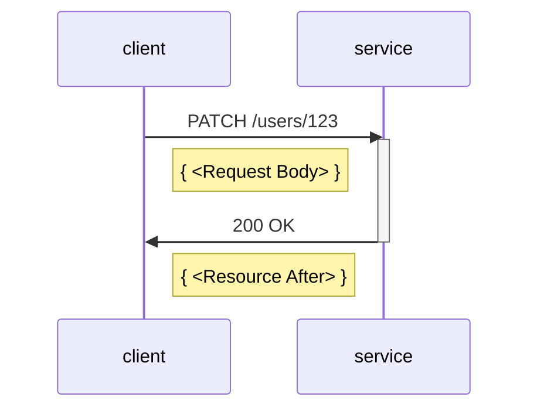
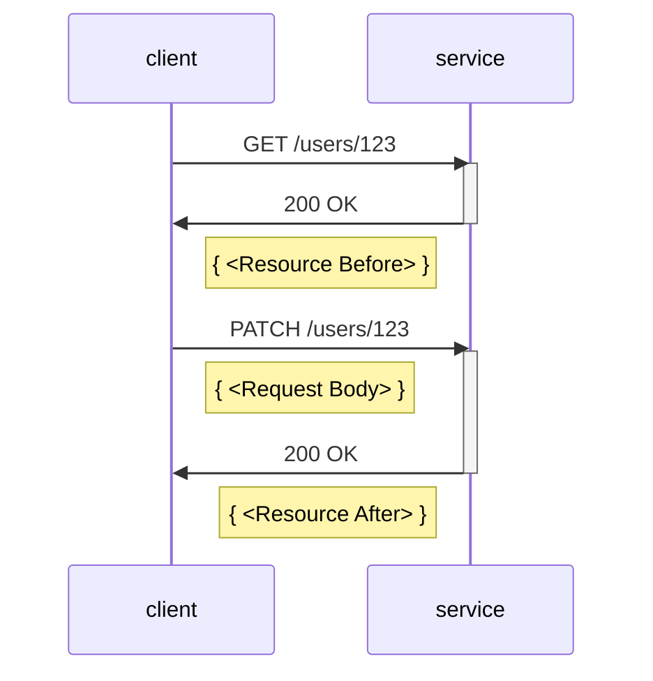
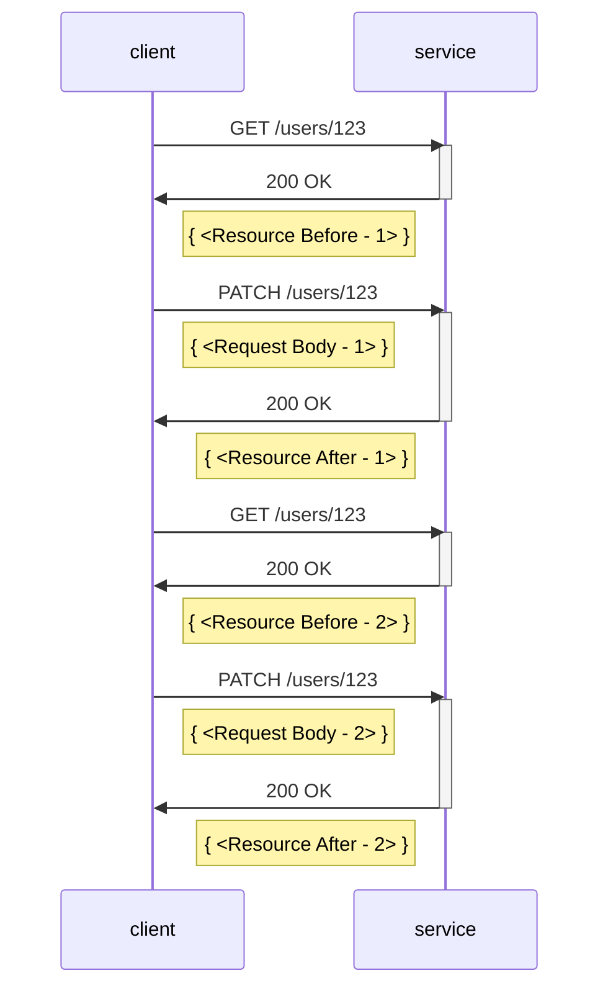
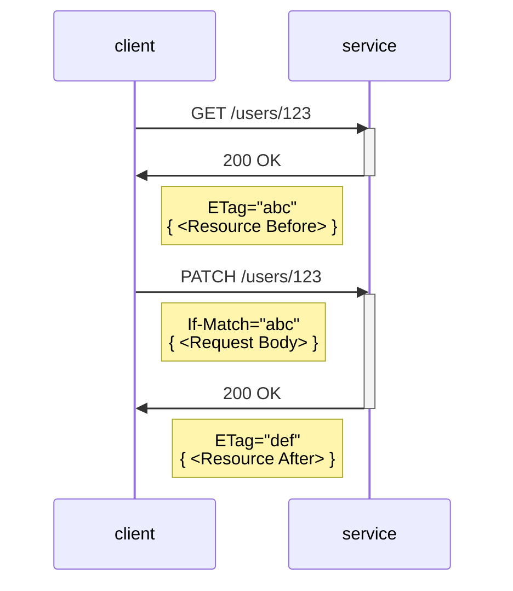
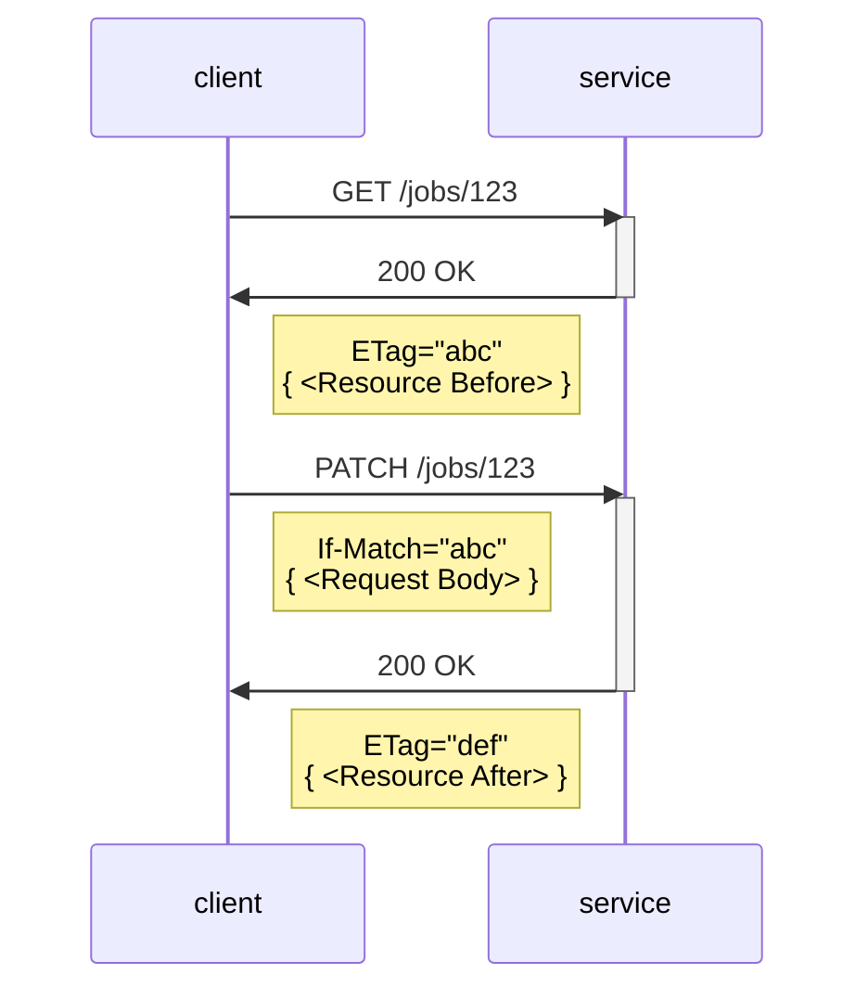

# Example cases for JSON Merge Patch Proposal

The following examples describe the proposed implementation for .NET Patch models for [JSON Merge Patch](https://www.rfc-editor.org/rfc/rfc7396) operations in Azure services.

Each section begins with a C# code sample, followed by an illustration of how the service-side resource would change as a result of the C# code.  These are followed by a brief diagram of HTTP traffic for completeness.

Most examples are complete, but some are discussions of tricky cases we want to handle in special ways.  Each section begins with a short description of which purpose they serve.

These examples are part of the larger discussion of .NET Patch models, documented in the following places:

- [JSON Merge Patch arch board issue](https://github.com/Azure/azure-sdk/issues/5966)
- [.NET Patch Models design principles](https://gist.github.com/annelo-msft/ae16eda80b382cc3ae9428954c08e069)

## TOC of example cases

1. [Create a new resource](#create-a-new-resource)
1. [Update a top-level property](#update-a-top-level-property)
1. [Update a property on a nested model](#update-a-property-on-a-nested-model)
1. [Replace a nested model](#replace-a-nested-model)
1. [Update a dictionary value](#update-a-dictionary-value)
1. [Clear a dictionary](#clear-a-dictionary)
1. [Update an array value - primitives](#update-an-array-value---primitives)
1. [Update an array value - objects](#update-an-array-value---objects)

## Create a new resource

### C# code

<details>
<summary><b>Model definitions</b></summary>

```csharp
public class User
{
    public User(string id) { /****/ }
    internal User(string id, string first, string last) { /****/ }

    public string Id { get; }
    public string FirstName { get; set; }
    public string LastName { get; set; }
}
```

</details>

```csharp
User user = new User("123");
user.FirstName = "Alice";
user.LastName = "Smith";
client.UpdateUser(user);
```

### Resource state

<table>
  <tr>
    <td><b>Resource Before</b></td>
    <td><b>Request Body: Merge Patch JSON</b></td>
    <td><b>Resource After</b></td>
  </tr>
  <tr>
<td valign="top">

```json
{
}
```

</td>
<td valign="top">

```json
{
  "firstName": "Alice", 
  "lastName": "Smith"
}
```

</td>
<td valign="top">

```diff
{
+  "id": "123",
+  "firstName": "Alice", 
+  "lastName": "Smith"
 } 
```

</td>
  </tr>
</table>

<details>
<summary><b>HTTP traffic</b></summary>



</details>

## Update a top-level property

### C# code

```csharp
public class User
{
    public User(string id) { /****/ }
    internal User(string id, string first, string last) { /****/ }

    public string Id { get; }
    public string FirstName { get; set; }
    public string LastName { get; set; }
}

User user = client.GetUser("123");
user.LastName = "Jones";
client.UpdateUser(user);
```

### Resource state

<table>
  <tr>
    <td><b>Resource Before</b></td>
    <td><b>Request Body: Merge Patch JSON</b></td>
    <td><b>Resource After</b></td>
  </tr>
  <tr>
<td valign="top">

```json
{
  "id": "123",
  "firstName": "Alice",
  "lastName": "Smith"
}
```

</td>
<td valign="top">

```json
{
  "lastName": "Jones"
}
```

</td>
<td valign="top">

```diff
{
  "id": "123",
  "firstName": "Alice", 
-  "lastName": "Smith"
+  "lastName": "Jones"
 } 
```

</td>
  </tr>
</table>

### HTTP traffic



## Update a property on a nested model

### C# code

```csharp
public class User
{
    public User(string id) { /****/ }
    internal User(string id, string first, string last, Address address) { /****/ }

    public string Id { get; }
    public string FirstName { get; set; }
    public string LastName { get; set; }
    public Address Address { get; set; }
}

public class Address
{
    public Address() { /****/ }
    internal Address(string street, string city, string state, string zip) { /****/ }

    public string Street { get; set; }
    public string City { get; set; }
    public string State { get; set; }
    public string ZipCode { get; set; }
}

User user = client.GetUser("123");
user.Address.Street = "15010 NE 36th St";
client.UpdateUser(user);
```

### Resource state

<table>
  <tr>
    <td><b>Resource Before</b></td>
    <td><b>Request Body: Merge Patch JSON</b></td>
    <td><b>Resource After</b></td>
  </tr>
  <tr>
<td valign="top">

```json
{
  "id": "123",
  "firstName": "Alice",
  "lastName": "Smith",
  "address" : {
    "street": "One Microsoft Way",
    "city": "Redmond",
    "state": "WA",
    "zipCode": "98052"
  }
}
```

</td>
<td valign="top">

```json
{
  "address": {
    "street": "15010 NE 36th St"
  }
}
```

</td>
<td valign="top">

```diff
{
  "id": "123",
  "firstName": "Alice",
  "lastName": "Smith",
  "address" : {
-    "street": "One Microsoft Way",
+    "street": "15010 NE 36th St",
    "city": "Redmond",
    "state": "WA",
    "zipCode": "98052"
  }
}
```

</td>
  </tr>
</table>

### HTTP traffic


## Replace a nested model

### C# code

```csharp
public class User
{
    public User(string id) { /****/ }
    internal User(string id, string first, string last, Address address) { /****/ }

    public string Id { get; }
    public string FirstName { get; set; }
    public string LastName { get; set; }
    public Address Address { get; set; }
}

// v1 model
public class Address
{
    public Address() { /****/ }
    internal Address(string street, string city, string state, string zip) { /****/ }

    public string Street { get; set; }
    public string City { get; set; }
    public string State { get; set; }
    public string ZipCode { get; set; }
}

// v2 model
public class Address
{
    public Address() { /****/ }
    internal Address(string street, string city, string state, string zip) { /****/ }

    public string Street { get; set; }

    // Note: Added in v2!
    public string StreetLineTwo { get; set;}

    public string City { get; set; }
    public string State { get; set; }
    public string ZipCode { get; set; }
}

// v1 client code - results in "torn write" data integrity issue
User user = v1Client.GetUser("123");
user.Address = new Address() {
    Street = "One Microsoft Way",
    City = "Redmond",
    State = "WA",
    ZipCode = "98052"
}
v1Client.UpdateUser(user);
```

### Resource state

<table>
  <tr>
    <td><b>Resource Before</b></td>
    <td><b>Request Body: Merge Patch JSON</b></td>
    <td><b>Resource After</b></td>
  </tr>
  <tr>
<td valign="top">

```json
{
  "id": "123",
  "firstName": "Alice",
  "lastName": "Smith",
  "address" : {
    "street": "54 State Street",
    "streetLine2": "Suite 701",
    "city": "Albany",
    "state": "NY",
    "zipCode": "12207"
  }
}
```

</td>
<td valign="top">

```json
{
  "address": {
    "street": "One Microsoft Way",
    "city": "Redmond",
    "state": "WA",
    "zipCode": "98052"
  }
}
```

</td>
<td valign="top">

```diff
{
  "id": "123",
  "firstName": "Alice",
  "lastName": "Smith",
  "address" : {
-    "street": "54 State Street",
+    "street": "One Microsoft Way",
    "streetLine2": "Suite 701",
-    "city": "Albany",
+    "city": "Redmond",
-    "state": "NY",
+    "state": "WA",
-    "zipCode": "12207"
+    "zipCode": "98052"
  }
}
```

</td>
  </tr>
</table>

### HTTP traffic


### Comments

Note that in the above example, if the `user.Address` property is set to a new model instance, the user might have the intention of overwriting the full `Address` value.  In a forward-compatibility scenario, if they use an earlier client version and a property was added to the `Address` model in a later version, they could end up in a "torn write" state, with compromised data integrity.

To help .NET users who may not have a deep understanding of forward compatibility scenarios, we would like to apply the following principle: _if you would have to send multiple requests to achieve a desired resource state on the service, we will require that you send multiple requests to do this._

In this case, that principle results in the following developer experience.

If a caller tries to overwrite the value of a service resource that could have evolved across versions, the caller can only modify it as follows:

1. They can set it to `null` to delete the resource.
1. If they have retrieved the resource and the model they are holding in-memory confirms that the value is absent or has been deleted, they can set it to a new instance of the model.

Overwriting a nested model that has a non-null value will result in an exception being thrown warning the caller about possible forward-compatibility data integrity issues.

### C# code - alternate approach, Example 2

```csharp
// v1 client code - "safe" because user doesn't believe they're replacing Address
User user = v1Client.GetUser("123");
user.Address.Street = "One Microsoft Way";
v1Client.UpdateUser(user);
```

### C# code - alternate approach, Example 3

```csharp
// v1 client code - "safe" because user is forced to delete the v2 Address completely before making an update
User user = v1Client.GetUser("123");

user.Address = null;
v1Client.UpdateUser(user);

user = v1Client.GetUser("123");
user.Address = new Address() {
    Street = "One Microsoft Way",
    City = "Redmond",
    State = "WA",
    ZipCode = "98052"
}
v1Client.UpdateUser(user);
```

### Resource state - Example 3

<table>
  <tr>
    <td><b>Resource Before</b></td>
    <td><b>Request Body: Merge Patch JSON</b></td>
    <td><b>Resource After</b></td>
  </tr>
  <tr>
<td valign="top">

```json
{
  "id": "123",
  "firstName": "Alice",
  "lastName": "Smith",
  "address" : {
    "street": "54 State Street",
    "streetLine2": "Suite 701",
    "city": "Albany",
    "state": "NY",
    "zipCode": "12207"
  }
}
```

</td>
<td valign="top">

```json
{
  "address": null
}
```

</td>
<td valign="top">

```diff
{
  "id": "123",
  "firstName": "Alice",
  "lastName": "Smith",
-  "address" : {
-    "street": "54 State Street",
-    "streetLine2": "Suite 701",
-    "city": "Albany",
-    "state": "NY",
-    "zipCode": "12207"
-  }
}
```

</td>
  </tr>
  <tr>
<td valign="top">

```json
{
  "id": "123",
  "firstName": "Alice",
  "lastName": "Smith"
}
```

</td>
<td valign="top">

```json
{
  "address" : {
    "street": "One Microsoft Way",
    "city": "Redmond",
    "state": "WA",
    "zipCode": "98052"
  }
}
```

</td>
<td valign="top">

```diff
{
  "id": "123",
  "firstName": "Alice",
  "lastName": "Smith",
+  "address" : {
+    "street": "One Microsoft Way",
+    "city": "Redmond",
+    "state": "WA",
+    "zipCode": "98052"
  }
}
```

</td>
  </tr>
</table>

### HTTP traffic - Example 3



## Update a dictionary value

TBD

## Clear a dictionary

TBD

## Update an array value - primitives

### C# code

```csharp
using System.Net.Http;

public class User
{
    public User(string id) { /****/ }
    internal User(string id, ETag eTag, string first, string last, IList<string> pets) { /****/ }

    public string Id { get; }
    public ETag ETag { get; set; }
    public string FirstName { get; set; }
    public string LastName { get; set; }
    public IList<string> Pets { get; }
}

Response<User> response;

do 
{
    User user = client.GetUser("123");
    user.Pets.Add("rizzo");

    response = client.UpdateUser(user, onlyIfUnchanged: true);
}
while (response.Status == HttpStatusCode.PreconditionFailed);
```

### Resource state

<table>
  <tr>
    <td><b>Resource Before</b></td>
    <td><b>Request Body: Merge Patch JSON</b></td>
    <td><b>Resource After</b></td>
  </tr>
  <tr>
<td valign="top">

```json
{
  "id": "123",
  "ETag": "abc",
  "firstName": "Alice",
  "lastName": "Smith",
  "pets": [
    "statler",
    "waldorf"
  ]
}
```

</td>
<td valign="top">

```txt
If-Match: "abc"
```

```json
{
  "pets": [
    "statler",
    "waldorf",
    "rizzo"
  ]
}
```

</td>
<td valign="top">

```diff
{
  "id": "123",
-  "ETag": "abc",
+  "ETag": "def",
  "firstName": "Alice", 
  "lastName": "Smith",
- "pets": [
-   "statler",
-   "waldorf"
+ ]
+ "pets": [
+   "statler",
+   "waldorf",
+   "rizzo"
+ ]
 } 
```

</td>
  </tr>
</table>

### HTTP traffic



### Comments

To help .NET users who may not have a deep understanding of the full details of the [JSON Merge Patch RFC](https://www.rfc-editor.org/rfc/rfc7396), we would like to apply the following principle: _if we need to send values in the Patch request body that the user did not explicitly modify in their application code, we should prevent accidental data loss from the result of sending these values._  Users should either use conditional requests to prevent unknowingly overwriting data on the server, or hand-author a request body to opt-in to the responsibility of handling nuances of the JSON Merge Patch RFC themselves.

In this instance, that principle results in the following developer experience.

If a caller modifies an array value and doesn't send an ETag in the PATCH request, we will throw an exception with a message that says one of the following:

1. If the service supports conditional requests, the message will direct the user to set the `If-Match` header on the PATCH request.  In the example above, this is accomplished by retrieving the resource value before updating it or setting the ETag property on the model manually.  Setting the optional `onlyIfUnchanged` parameter in the `UpdateUser` method adds the value of the ETag property from the model to the `If-Match` header on the request.
1. If the service does not support conditional requests, the message will instruct the user to compose the PATCH JSON payload by hand and send it using the corresponding protocol method.  In this case, no `onlyIfUnchanged` parameter will be in the method signature of the update method, since the service does not support it.

Note that if the array value in the `User` model is not modified, no exception will be thrown from the update method because the client did not try to send values that the user did not modify.

For further details of conditional requests, see:

- [If-Match](https://developer.mozilla.org/en-US/docs/Web/HTTP/Headers/If-Match)
- [Avoiding mid-air collisions](https://developer.mozilla.org/en-US/docs/Web/HTTP/Status/412#avoiding_mid-air_collisions)

## Update an array value - objects

### C# code

```csharp
using System.Net.Http;

public class RouterJob
{
    public RouterJob(string id) { /****/ }
    internal RouterJob(string id, string channelId, int priority, List<RouterWorkerSelector> selectors) { /****/ }

    public string Id { get; }
    public ETag ETag { get; set; }
    public string ChannelId { get; set; }
    public int Priority { get; set; }
    public IList<RouterWorkerSelector> Selectors { get; }
}

public class RouterWorkerSelector
{
    public RouterWorkerSelector() { /****/ }
    internal RouterWorkerSelector(string key, bool expedite) { /****/ }

    public string Key { get; set; }
    public bool Expedite { get; set; }
}

Response<RouterJob> response;

do 
{
    RouterJob job = client.GetJob("123");
    job.Selectors[0].Expedite = true;

    response = client.UpdateJob(job, onlyIfUnchanged: true);
}
while (response.Status == HttpStatusCode.PreconditionFailed);
```

### Resource state

<table>
  <tr>
    <td><b>Resource Before</b></td>
    <td><b>Request Body: Merge Patch JSON</b></td>
    <td><b>Resource After</b></td>
  </tr>
  <tr>
<td valign="top">

```json
{
  "id": "123",
  "ETag": "abc",
  "channelId": "ChatChannel",
  "priority": "2",
  "selectors": [
    {
        "key": "A",
        "expedite": false
    },
    {
        "key": "B",
        "expedite": false
    },
    {
        "key": "C",
        "expedite": false
    }
  ]
}
```

</td>
<td valign="top">

```txt
If-Match: "abc"
```

```json
{
  "selectors": [
    {
      "key": "A",
      "expedite": true
    },
    {
      "key": "B",
      "expedite": false
    },
    {
      "key": "C",
      "expedite": false
    }
  ]
}
```

</td>
<td valign="top">

```diff
{
  "id": "123",
-  "ETag": "abc",
+  "ETag": "def",
  "channelId": "ChatChannel",
  "priority": "2",
  "selectors": [
    {
        "key": "A",
-       "expedite": false
+       "expedite": true
    },
    {
        "key": "B",
        "expedite": false
    },
    {
        "key": "C",
        "expedite": false
    }
  ]
}
```

</td>
  </tr>
</table>

### HTTP traffic



### Comments

Please see **Comments** section in [Update an array value - primitives](#update-an-array-value---primitives) section above.
